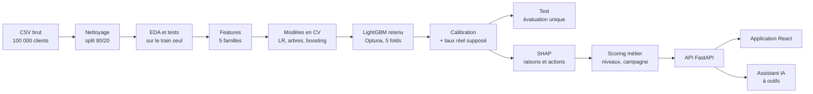

# Prédiction du churn télécom

Atelier ESSAI (1re année), rendu du 2 octobre 2026.

Un opérateur télécom veut savoir **quels clients risquent de partir le mois prochain, pourquoi,
et qui contacter en priorité** avec un budget de campagne limité. Le projet livre :

- un **modèle LightGBM calibré**, dont les probabilités sont ramenées à un taux de churn réel supposé ;
- des **explications par client** (SHAP), traduites en raisons et en actions commerciales ;
- un **scoring métier** : niveaux de risque, chiffre de campagne, revenu en jeu ;
- une **API FastAPI**, une **application React** de pilotage et d'opérations, et un **assistant IA à outils** (Gemini, avec un mode démonstration hors ligne).


## Le problème en chiffres

Sur un portefeuille de 100 000 clients, au taux de churn **supposé** de 2 % par mois :

| Indicateur | Valeur |
|---|---|
| Départs attendus le mois prochain | **2 002** |
| Revenu mensuel en jeu | **116 162 $** |
| Campagne sur les 10 % de clients actifs les plus risqués | **51 futurs churners pour 1 000 contactés**, contre 20 au hasard (× 2,55) |
| Part des départs attendus portée par les clients High (10 % du portefeuille) | 25 % |

Ce sont des churners **atteints**, pas des départs évités : ceux-ci dépendent du taux de succès
de l'offre, inconnu, qui doit être mesuré avec un groupe témoin.

## Données

- Base **Cell2Cell** : 100 000 clients, 100 colonnes (usage, facture, terminal, ancienneté, service client, données socio-démographiques). Le fichier `data/raw/telco_churn.csv` n'est **pas versionné** : il faut le récupérer avec le sujet de l'atelier.
- Cible `churn` : départ dans la fenêtre qui suit la mesure, soit environ un mois. L'échantillon est **équilibré** (49,6 % de churners), alors qu'un vrai portefeuille perd de l'ordre de 2 % de clients par mois. Ce taux est une **hypothèse** (`configs/config.yaml`), avec une sensibilité testée de 1 à 3 %.
- Split **80/20 stratifié avant toute exploration** (graine 42). Le test n'a servi à aucun choix.
- Exclues du modèle : `Customer_ID`, `churn` et `ethnic`.

## Démarche



| Étapes | Contenu | Où le lire |
|---|---|---|
| E1-E4 | Audit, nettoyage, split, EDA, tests statistiques, segmentation descriptive (K-means) | `notebooks/01` à `03`, `02b` |
| E5-E8 | Features (cycle d'engagement, tendance d'usage, forfait, terminal, manquants), baselines, modèles avancés, test de fuite | `notebooks/04`, `05` |
| E9-E10 | Réglage Optuna, choix en CV, évaluation finale, calibration sigmoïde, correction du prior | `notebooks/06` |
| E11-E12 | SHAP, codes de raisons (actionnables / contexte), niveaux de risque, campagne, artefacts | `notebooks/07`, `08` |
| E13, E16 | Services, API (18 endpoints), assistant IA (8 outils, garde-fous) | `api/`, `src/churn/` |
| E14-E17 | Application React (5 pages), chat, parcours de démonstration | `frontend/` |

Toutes les décisions sont justifiées dans [`docs/decisions.md`](docs/decisions.md) (D1 à D121).
Chaque étape a son bilan dans [`docs/bilans.md`](docs/bilans.md).

## Résultats

**Modèle** (fiche complète : [`models/model_card.md`](models/model_card.md))

| | AUC | Lecture |
|---|---|---|
| LightGBM, validation croisée (5 folds, train) | 0,6942 ± 0,0042 | modèle retenu par la règle de l'écart-type |
| **LightGBM, test (20 000 clients)** | **0,6955 [0,6881 ; 0,7024]** | dans l'intervalle de la CV : pas d'optimisme visible |
| Régression logistique améliorée, test | 0,6686 | + 27 millièmes pour LightGBM [+23 ; +31] |
| Règles métier simples, test | 0,6174 | référence |

- **Calibration** : erreur de calibration (ECE) de 0,0122 à 0,0046 sur le test, AUC inchangée.
- **Ciblage** : le top 10 % contient 2,8 fois plus de futurs churners que le hasard (au taux supposé de 2 %).
- **Facteurs dominants selon le modèle** : âge du terminal, évolution de l'usage, fin d'engagement (pic de risque à 11-12 mois d'ancienneté). Ce sont des associations, pas des causes.
- **Niveaux** : High = 10 % du portefeuille (capacité de campagne), Medium jusqu'à 30 %, Low, et les **inactifs** à part (vérifier la ligne plutôt qu'une offre).

**Assistant IA** ([`docs/assistant_eval.md`](docs/assistant_eval.md))

| Fournisseur | Questions | Bon outil | Chiffres fidèles |
|---|---|---|---|
| Mode démonstration | 15 | 15/15 | 15/15 |
| Gemini (quota gratuit) | 4 | 4/4 | 4/4 (dont une après correction d'un outil) |

Le LLM ne calcule rien. Il appelle des outils qui lisent les mêmes artefacts que le tableau de
bord, et un garde-fou vérifie chaque nombre de sa réponse. Le jour de la soutenance, Gemini
était trop lent (10,3 s) ou indisponible : la démonstration se fait en mode démo, avec les mêmes
outils et donc les mêmes chiffres (D120).

## Captures

| | |
|---|---|
|  Un clic sur un graphique devient un filtre global |  Simulateur de campagne : mesures du modèle et hypothèses séparées |
|  Fiche client : risque, raisons selon le modèle, action |  Assistant : outils utilisés et hypothèses annoncées |

Les 8 étapes du parcours de démonstration, en clair et en sombre, sont dans
`frontend/screenshots/demo/`. Le script de la soutenance est dans
[`docs/demo_script.md`](docs/demo_script.md).

## Lancement

Prérequis :
- Python 3.11, Node.js 20.19 ou plus (ou 22.12 et plus), et `make` (sous Windows : `mingw32-make`) ;
- le CSV placé dans `data/raw/telco_churn.csv`.

```bash
python -m venv .venv              # environnement Python 3.11
make install                      # dépendances Python et frontend
make data train artifacts         # split, modèle, scores et SHAP (environ 15 minutes)
make dev                          # API sur :8000 et application sur http://localhost:5173
```

- L'application fonctionne **sans clé API** : l'assistant passe alors en mode démonstration.
- Pour utiliser Gemini, copier `.env.example` en `.env` et renseigner `LLM_PROVIDER=gemini`, `LLM_MODEL` et `LLM_API_KEY`. La clé reste côté serveur.

Autres commandes :

| Commande | Rôle |
|---|---|
| `make test` | pytest (161 tests), ruff et ESLint |
| `make check` | contrôle du CSV brut (forme, répartition de la cible) |
| `make api` / `make front` | API ou frontend seuls |
| `python scripts/eval_assistant.py --demo` | évaluation des 15 questions de l'assistant |

## Organisation du dépôt

```
configs/config.yaml        paramètres, hypothèses métier (taux réel, capacité)
src/churn/                 code : données, features, modèles, évaluation, SHAP, scoring, services, assistant
api/                       FastAPI (routers fins qui appellent churn.services et churn.assistant)
frontend/                  React 19, TypeScript strict, Mantine, ECharts, AG Grid, TanStack Query
notebooks/                 analyses commentées (importent src/churn, sans dupliquer le code)
scripts/                   make_dataset, train, build_artifacts, eval_assistant
tests/                     tests Python (split, features, fuite, inférence, API, outils IA)
models/model_card.md       fiche du modèle
docs/                      contexte, décisions, bilans, évaluation de l'assistant, script de démo
reports/                   métriques et figures produites par les notebooks
```

## Limites

- **Signal modeste** : une AUC de 0,70 suffit à prioriser une campagne (× 2,55 par rapport au hasard), pas à prédire un départ individuel. Au taux supposé, seuls 1,7 % des clients dépassent 10 % de risque mensuel.
- **Chiffres absolus conditionnels** : effectifs « estimation portefeuille », probabilités mensuelles et revenu en jeu dépendent du taux réel supposé (2 %). Le classement, lui, n'en dépend pas.
- **Pas de validation temporelle** : le split est aléatoire, sans période future.
- **SHAP n'est pas causal** : une raison décrit le modèle, et l'effet d'une action reste à mesurer.
- **Variables socio-démographiques** : 19 restent des entrées du modèle. Elles ne sont jamais affichées ni transmises à l'assistant, mais l'équité du score n'a pas été auditée.
- **Assistant** : Gemini n'a pu être évalué que sur 4 questions (quota gratuit de 20 requêtes par jour). Le mode démonstration ne répond qu'aux formulations proches de son scénario.

## Perspectives

- Mesurer le vrai taux de churn et le taux de succès de l'offre (groupe témoin), puis remplacer les hypothèses.
- Valider sur une période future et suivre la dérive du score.
- Réentraîner sans les variables sensibles et mesurer le coût en AUC ; auditer l'équité.
- Passer à une offre Gemini payante, avec un contrat de traitement des données, pour une évaluation complète et une latence stable.
- Conteneuriser l'API et le frontend pour un déploiement.
