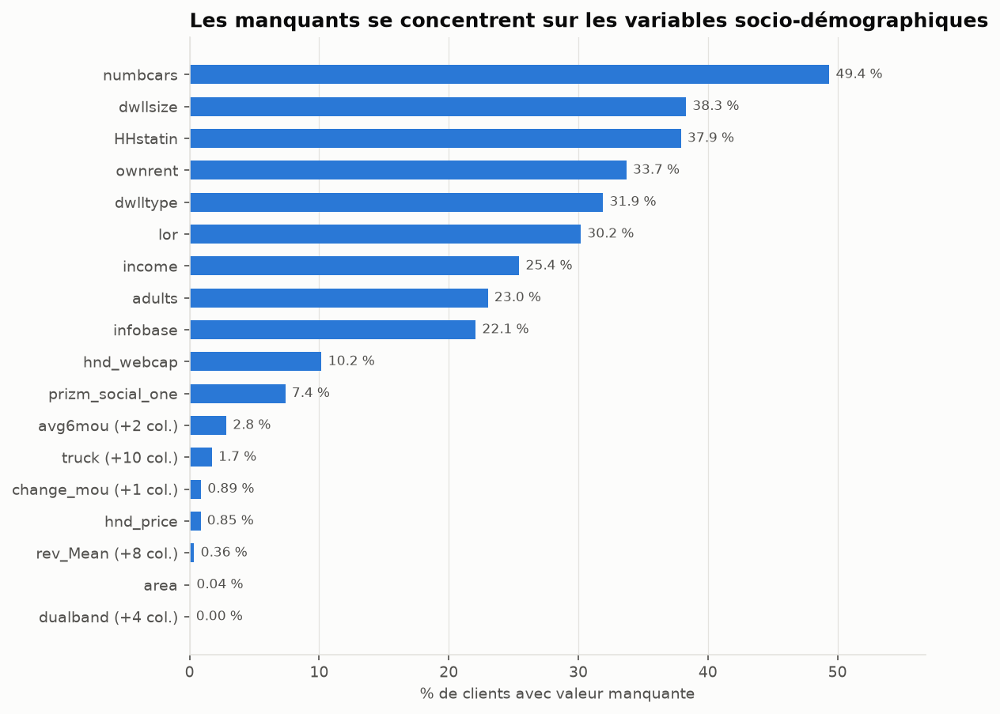
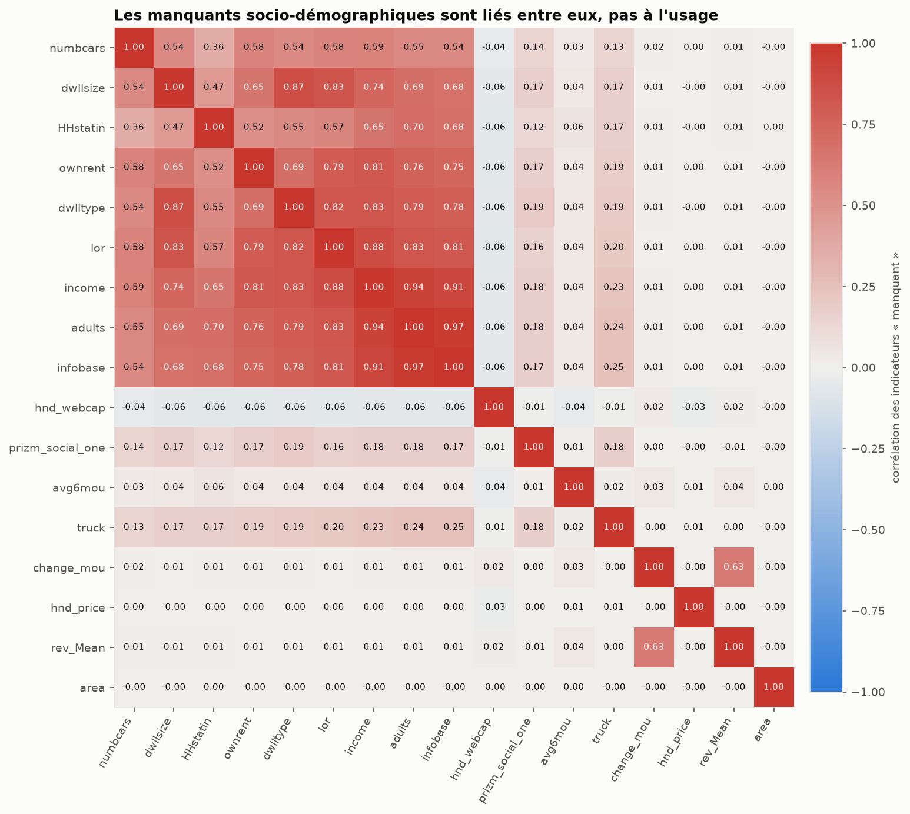

# Rapport qualité des données — Telecom churn

Généré par `notebooks/01_data_audit.ipynb` à partir de `telco_churn.csv` : 100000 lignes × 100 colonnes, avant split.
Cible : churn = 1 pour 49.56% des clients. Décisions détaillées : `docs/decisions.md`.

## Synthèse des anomalies et décisions

| Anomalie | Constat | Décision | Réf. |
|---|---|---|---|
| Valeurs négatives impossibles | eqpdays (133), totmrc_Mean (23), rev_Mean (5), avg6rev (3) | NaN + indicateur `_was_negative` dans clean() | D19 |
| Code « inconnu » différent selon la colonne | U : new_cell, dualband, marital, kid* ; UNKW : hnd_webcap | → modalité `Unknown` ; prizm_social_one U = Urban conservé | D20 |
| NaN (donnée non collectée) | 18 motifs, 22 à 49 % sur le socio externe | Conservés ; imputés dans le pipeline | D21 |
| Manquant lié au churn | 15/16 motifs significatifs (Holm), V ≤ 0.065 | Indicateur par motif en E6 | D22 |
| Colonnes > 40 % de NaN | numbcars (49,4 %) | Pas de suppression a priori ; tranché en CV (E6) | D23 |
| Clients sans usage | 357 lignes | Conservés ; possible fuite « déjà parti » (avec change_* manquants), test avec / sans en E8 | D24, D32 |
| avg6* manquant | 2839 clients, dont 92.5% à 6-8 mois | Surtout structurel (clients récents) ; indicateur | D25 |
| Règles de cohérence strictes | 10 règles, 0 violation | Garde-fou dans le schéma pandera | D26 |
| adjrev > totrev ; ovrrev ≠ vceovr + datovr | 48 ; 187 | Non corrigé (écart explicable) | D27 |
| eqpdays > ancienneté ; actvsubs = 0 | 5145 ; 81 | Conservés (plausibles) | D28 |
| Outliers (queues lourdes) | Tukey : 0,3 à 26 % ; maxima isolés roam_Mean, change_rev, uniqsubs | Aucune suppression ; transformation dans le pipeline | D29 |
| Doublons | 0 ID, 0 ligne | Aucune action | D30 |
| area manquant ; ligne sans terminal | 40 ; 1 | Conservés ; imputés dans le pipeline | D31 |

## 1. Validation du schéma brut (pandera)

| column | check | n_cas | exemples |
|---|---|---|---|
| eqpdays | greater_than_or_equal_to(0) | 133 | -1.0, -2.0, -3.0, -4.0, -5.0 |
| eqpdays | in_range(0, 3650) | 133 | -1.0, -2.0, -3.0, -4.0, -5.0 |
| totmrc_Mean | greater_than_or_equal_to(0) | 23 | -0.08, -0.0825, -0.24, -0.27, -0.2825 |
| rev_Mean | greater_than_or_equal_to(0) | 5 | -0.16, -2.52, -3.73, -5.8625, -6.1675 |
| avg6rev | greater_than_or_equal_to(0) | 3 | -1.0, -2.0 |

Après `clean()` : **0 échec** du schéma `clean`.

## 2. Valeurs manquantes (motifs de colonnes toujours absentes ensemble)

| groupe | n_colonnes | n_manquants | pct | colonnes |
|---|---|---|---|---|
| numbcars | 1 | 49366 | 49.37 | numbcars |
| dwllsize | 1 | 38308 | 38.31 | dwllsize |
| HHstatin | 1 | 37923 | 37.92 | HHstatin |
| ownrent | 1 | 33706 | 33.71 | ownrent |
| dwlltype | 1 | 31909 | 31.91 | dwlltype |
| lor | 1 | 30190 | 30.19 | lor |
| income | 1 | 25436 | 25.44 | income |
| adults | 1 | 23019 | 23.02 | adults |
| infobase | 1 | 22079 | 22.08 | infobase |
| hnd_webcap | 1 | 10189 | 10.19 | hnd_webcap |
| prizm_social_one | 1 | 7388 | 7.39 | prizm_social_one |
| avg6mou | 3 | 2839 | 2.84 | avg6mou, avg6qty, avg6rev |
| truck | 11 | 1732 | 1.73 | truck, rv, marital, forgntvl, ethnic, kid0_2, kid3_5, kid6_10, kid11_15, kid16_17, creditcd |
| change_mou | 2 | 891 | 0.89 | change_mou, change_rev |
| hnd_price | 1 | 847 | 0.85 | hnd_price |
| rev_Mean | 9 | 357 | 0.36 | rev_Mean, mou_Mean, totmrc_Mean, da_Mean, ovrmou_Mean, ovrrev_Mean, vceovr_Mean, datovr_Mean, roam_Mean |
| area | 1 | 40 | 0.04 | area |
| dualband | 5 | 1 | 0.00 | dualband, refurb_new, phones, models, eqpdays |

## 3. « Est manquant » × churn (χ², Holm, V de Cramér)

| groupe | n_colonnes | pct_manquant | churn_si_manquant | churn_si_present | ecart_pts | cramers_v | p_holm | significatif |
|---|---|---|---|---|---|---|---|---|
| hnd_webcap | 1 | 10.19 | 59.2 | 48.5 | 10.7 | 0.0646 | 1.4e-91 | True |
| change_mou | 2 | 0.89 | 76.1 | 49.3 | 26.8 | 0.0503 | 7.9e-56 | True |
| avg6mou | 3 | 2.84 | 40.2 | 49.8 | -9.6 | 0.0319 | 8.2e-23 | True |
| infobase | 1 | 22.08 | 52 | 48.9 | 3.1 | 0.0258 | 4.9e-15 | True |
| hnd_price | 1 | 0.85 | 36.7 | 49.7 | -13 | 0.0237 | 7.2e-13 | True |
| adults | 1 | 23.02 | 51.7 | 48.9 | 2.8 | 0.0236 | 8.8e-13 | True |
| lor | 1 | 30.19 | 51.4 | 48.8 | 2.6 | 0.0236 | 8.8e-13 | True |
| dwllsize | 1 | 38.31 | 51 | 48.6 | 2.4 | 0.0232 | 2.0e-12 | True |
| rev_Mean | 9 | 0.36 | 68.6 | 49.5 | 19.1 | 0.0228 | 4.2e-12 | True |
| HHstatin | 1 | 37.92 | 51 | 48.7 | 2.3 | 0.0223 | 1.3e-11 | True |
| income | 1 | 25.44 | 51.4 | 48.9 | 2.5 | 0.0219 | 2.4e-11 | True |
| dwlltype | 1 | 31.91 | 51.2 | 48.8 | 2.4 | 0.0219 | 2.4e-11 | True |
| ownrent | 1 | 33.71 | 51 | 48.8 | 2.2 | 0.0209 | 1.6e-10 | True |
| numbcars | 1 | 49.37 | 50.2 | 48.9 | 1.3 | 0.0133 | 8.4e-05 | True |
| prizm_social_one | 1 | 7.39 | 51.6 | 49.4 | 2.2 | 0.0113 | 6.7e-04 | True |
| truck | 10 | 1.73 | 47.9 | 49.6 | -1.7 | 0.0045 | 1.5e-01 | False |

Toutes les tailles d'effet sont faibles (V < 0,1) : ces motifs justifient des indicateurs, pas des conclusions causales.

## 4. Cohérence

| regle | description | type | violations | pct |
|---|---|---|---|---|
| actvsubs_le_uniqsubs | abonnements actifs <= abonnements uniques | stricte | 0 | 0.00 |
| models_le_phones | modèles distincts <= terminaux | stricte | 0 | 0.00 |
| comp_vce_le_plcd_vce | appels voix aboutis <= passés | stricte | 0 | 0.00 |
| comp_dat_le_plcd_dat | appels data aboutis <= passés | stricte | 0 | 0.00 |
| complete_le_attempt | appels aboutis <= tentés | stricte | 0 | 0.00 |
| attempt_eq_plcd | attempt = plcd_vce + plcd_dat | stricte | 0 | 0.00 |
| drop_blk_eq_sum | drop_blk = drop_vce + drop_dat + blck_vce + blck_dat | stricte | 0 | 0.00 |
| adjmou_le_totmou | minutes ajustées <= minutes totales | stricte | 0 | 0.00 |
| adjqty_le_totcalls | appels ajustés <= appels totaux | stricte | 0 | 0.00 |
| usage_block_all_or_none | bloc d'usage entièrement présent ou absent | stricte | 0 | 0.00 |
| adjrev_le_totrev | revenu ajusté <= revenu total | informative | 48 | 0.05 |
| ovrrev_eq_vce_dat | ovrrev = vceovr + datovr | informative | 187 | 0.19 |
| eqpdays_le_tenure | âge du terminal <= ancienneté (months x 31 j) | informative | 5145 | 5.14 |
| actvsubs_ge_1 | au moins un abonnement actif | informative | 81 | 0.08 |

## 5. Outliers

| variable | min | q25 | mediane | q75 | q999 | max | max_sur_q999 | n_sup_q999 | pct_hors_tukey | asymetrie |
|---|---|---|---|---|---|---|---|---|---|---|
| rev_Mean | -6.17 | 33.26 | 48.20 | 70.75 | 450.86 | 3 843.26 | 8.50 | 100 | 6.00 | 9.20 |
| totmrc_Mean | -26.91 | 30.00 | 44.99 | 59.99 | 199.99 | 409.99 | 2.10 | 87 | 1.81 | 1.60 |
| ovrrev_Mean | 0.00 | 0.00 | 1.00 | 14.44 | 313.44 | 1 102.40 | 3.50 | 99 | 11.36 | 6.20 |
| roam_Mean | 0.00 | 0.00 | 0.00 | 0.23 | 89.61 | 3 685.20 | 41.10 | 100 | 18.98 | 168.80 |
| totrev | 3.65 | 518.98 | 804.53 | 1 263.77 | 7 918.67 | 27 321.50 | 3.50 | 100 | 5.68 | 3.80 |
| avgrev | 0.48 | 35.37 | 49.89 | 69.48 | 326.02 | 924.27 | 2.80 | 100 | 5.31 | 3.20 |
| mou_Mean | 0.00 | 150.75 | 355.50 | 703.00 | 3 765.00 | 12 206.75 | 3.20 | 99 | 5.17 | 2.30 |
| ovrmou_Mean | 0.00 | 0.00 | 2.75 | 42.00 | 1 058.27 | 4 320.75 | 4.10 | 100 | 11.57 | 7.40 |
| totmou | 0.00 | 2 529.00 | 5 191.50 | 9 776.00 | 87 989.89 | 233 419.10 | 2.70 | 100 | 5.99 | 4.40 |
| change_mou | -3 875.00 | -87.00 | -6.25 | 63.00 | 1 542.06 | 31 219.25 | 20.20 | 100 | 13.61 | 14.40 |
| change_rev | -1 107.74 | -7.37 | -0.32 | 1.64 | 302.21 | 9 963.66 | 33.00 | 100 | 26.05 | 80.50 |
| custcare_Mean | 0.00 | 0.00 | 0.00 | 1.67 | 46.67 | 675.33 | 14.50 | 99 | 12.71 | 32.00 |
| drop_vce_Mean | 0.00 | 0.67 | 3.00 | 7.67 | 86.33 | 232.67 | 2.70 | 100 | 7.14 | 4.60 |
| uniqsubs | 1.00 | 1.00 | 1.00 | 2.00 | 7.00 | 196.00 | 28.00 | 82 | 3.90 | 60.50 |
| eqpdays | -5.00 | 212.00 | 342.00 | 530.00 | 1 565.00 | 1 823.00 | 1.20 | 100 | 2.59 | 1.00 |
| hnd_price | 9.99 | 29.99 | 99.99 | 149.99 | 399.99 | 499.99 | 1.30 | 63 | 0.26 | 0.50 |
| months | 6.00 | 11.00 | 16.00 | 24.00 | 56.00 | 61.00 | 1.10 | 100 | 2.29 | 1.10 |

## 6. Doublons

| doublons_id | doublons_lignes_hors_id |
|---|---|
| 0 | 0 |
